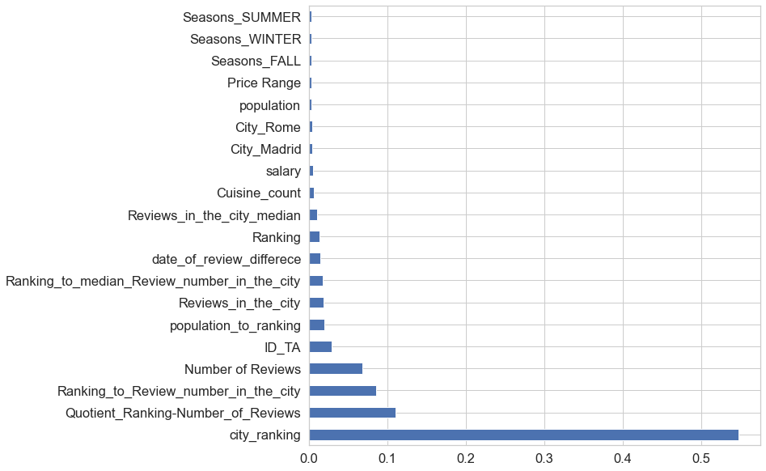

# SF - ПРОЕКТ 3. О ВКУСНОЙ И ЗДОРОВОЙ ПИЩЕ

## Цель:
предсказать рейтинг ресторана в TripAdvisor

## Задачи:
* Проанализировать имеющиеся данные
* Научиться обрабатывать сырые данные
* Добавить сторонние данные
* Сгенерировать новые признаки из имеющихся, в том числе dummy
* Выбрать нужные признаки для наилучшего предсказания рейтинга ресторана

## Краткая информация о входных данных
*Первоначальная версия датасета состоит из десяти столбцов, содержащих следующую информацию:*  
Restaurant_id — идентификационный номер ресторана / сети ресторанов; 
City — город, в котором находится ресторан; 
Cuisine Style — кухня или кухни, к которым можно отнести блюда, предлагаемые в ресторане; 
Ranking — место, которое занимает данный ресторан среди всех ресторанов своего города; 
Rating — рейтинг ресторана по данным TripAdvisor (именно это значение должна будет предсказывать модель); 
Price Range — диапазон цен в ресторане; 
Number of Reviews — количество отзывов о ресторане; 
Reviews — данные о двух отзывах, которые отображаются на сайте ресторана; 
URL_TA — URL страницы ресторана на TripAdvisor; 
ID_TA — идентификатор ресторана в базе данных TripAdvisor.

## Информация об обработке данных по следующим признакам:
* Restaurant_id - удален
* Price Range - перекодирован в числовой вид
* Number of Reviews - заменены пропуски
* Cuisine Style - подготовлен для создания dummy-признаков
* City - город Oporto переименован в Porto
* Reviews - подготовлен к виду, из которого можно выбрать даты отзывов
* URL_TA - удален
* ID_TA - перекодирован в числовой вид

## Добавление сторонних данных
Добавлены данные по населению городов population, а также о медианной зарплате жителей этих городов salary

## Созданные новые признаки:
* chain - если id повторяется, то 1 - сетевой ресторан, 0 - нет
* rest_in_city - количество ресторанов внутри данного города
* Reviews_in_the_city - количество отзывов внутри данного города
* Ranking_to_Review_number_in_the_city - соотношение ранкинга к количеству отзывов внутри данного города
* Reviews_in_the_city_median - медианное количество отзывов в данном городе
* Ranking_to_median_Review_number_in_the_city -  отношение ранкинга к медианному количеству отзывов в данном городе
* Quotient_Ranking-Number_of_Reviews - связь Ranking c числом отзывов
* population_to_ranking - отношение населения города к Ranking
* first_date - дата первого отзыва
* second_date - дата второго отзыва
* date_of_review_differece - разница в днях между отзывами
* Cuisine_count - количество кухонь в ресторане
* dummy: City, Cuisine, времена года когда был оставлен отзыв

## Признаки, которые использовались для построения модели:
'Ranking', 'Price Range', 'Number of Reviews', 'ID_TA', 'sample',
'Rating', 'population', 'Number_of_Reviews_isNAN', 'city_ranking',
'salary', 'Reviews_in_the_city', 'Ranking_to_Review_number_in_the_city',
'Reviews_in_the_city_median','Ranking_to_median_Review_number_in_the_city',
'City_Amsterdam','City_Athens', 'City_Barcelona', 'City_Berlin', 'City_Bratislava',
'City_Brussels', 'City_Budapest', 'City_Copenhagen', 'City_Dublin',
'City_Edinburgh', 'City_Geneva', 'City_Hamburg', 'City_Helsinki',
'City_Krakow', 'City_Lisbon', 'City_Ljubljana', 'City_London',
'City_Luxembourg', 'City_Lyon', 'City_Madrid', 'City_Milan',
'City_Munich', 'City_Oslo', 'City_Paris', 'City_Porto', 'City_Prague',
'City_Rome', 'City_Stockholm', 'City_Vienna', 'City_Warsaw',
'City_Zurich', 'date_of_review_differece', 'Seasons_WINTER',
'Seasons_SPRING', 'Seasons_SUMMER', 'Seasons_FALL', 'holiday_1', 'Bar',
'French', 'Pizza', 'Italian', 'European', 'Gluten Free Options',
'Vegan Options', 'Asian', 'Vegetarian Friendly', 'Spanish',
'Mediterranean', 'Cuisine_count', 'Quotient_Ranking-Number_of_Reviews',
'population_to_ranking'

## Относительный вклад признаков в модель

## Итоговый MAE: 0.195
